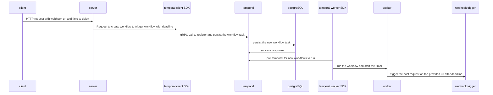
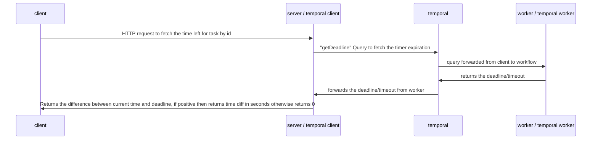

# Workflow Schedular Runtime

A highly scalable service to schedule workflow jobs/tasks with timers with persistance. The system is build to be distributed to scale with resilience.

## Technologies Used

1. [Temporal](https://temporal.io/) - It is a scalable and reliable runtime for Reentrant Processes. It's battle-tested at scale and used in production by companies like uber, netflix, snap (snapchat) etc. More about temporal:

   - [Docs](https://docs.temporal.io/temporal)
   - [TL;DR Intro Video](https://www.youtube.com/watch?v=2HjnQlnA5eY)

2. [PostgreSQL](https://www.postgresql.org/) - Used for persistance of workflows alongside temporal.
3. [Nest](https://github.com/nestjs/nest) - NodeJS TypeScript Framework.

## Description

The service is a monorepo divided into two systems:

1. server: The service is responsible for serving requests to schedule webhook triggers into temporal
2. worker: The service responsible for polling workflows/jobs/tasks from temporal and execute the webhook triggers

System Design Architecture Diagram:


## Prerequisites

1. Make sure [Docker](https://www.docker.com/products/docker-desktop/) is installed on the system
2. Copy the `.env` file from `.env.example`

```bash
$ cp .env.example .env
```

## Running the app

In the main directory, run the following command:

```bash
$ docker compose up -d
```

## Helper tools

1. Swagger Docs: For testing out REST endpoints, Hosted at `/api-docs` path, for [localhost](http://localhost:3000/api-docs)
2. Temporal UI: For deep visibility into scheduled tasks/jobs, for [localhost](http://localhost:8080)

## How it works

### 1. POST /timers



### 2. GET /timers/:id



## Test

```bash
# install packages
$ npm i

# e2e tests
$ npm run test:e2e
```

## Tasks

- [x] POST /timers api to schedule the webhook trigger with timer and return id of the scheduled task. Shoots post http call with empty body after timeout
- [x] GET /timers/:id api to fetch time left in seconds until timer expires. Return 0 if already expired
- [x] Persist timer and timers shouldn't reset if system is down(They are persisted inside postgreSQL via temporal)
- [x] If all the workers are down, and when they are back, they pick up the tasks to be processed and if timers are expired already they shoot post request
- [x] Docker compose file to run the whole system by single command
- [x] API test cases (not all cases covered yet)
